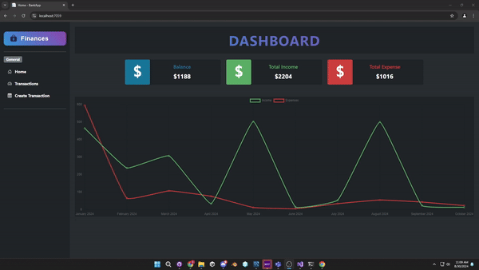
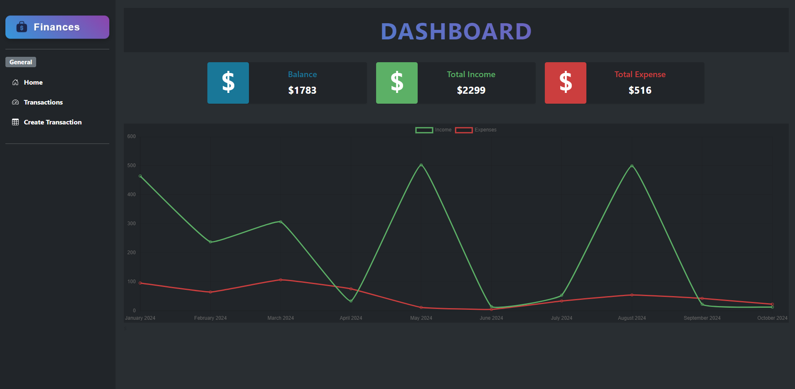
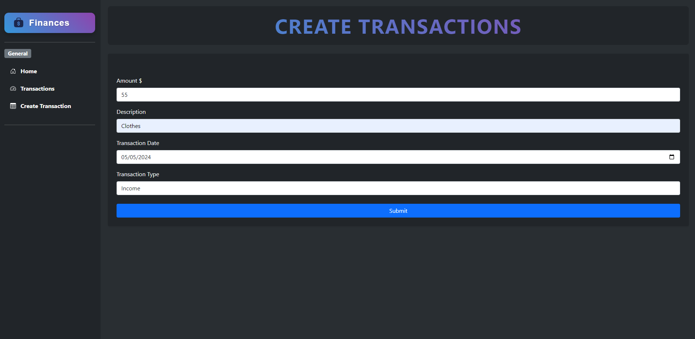
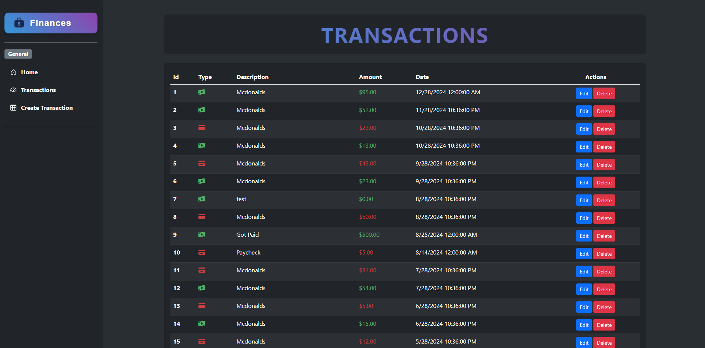
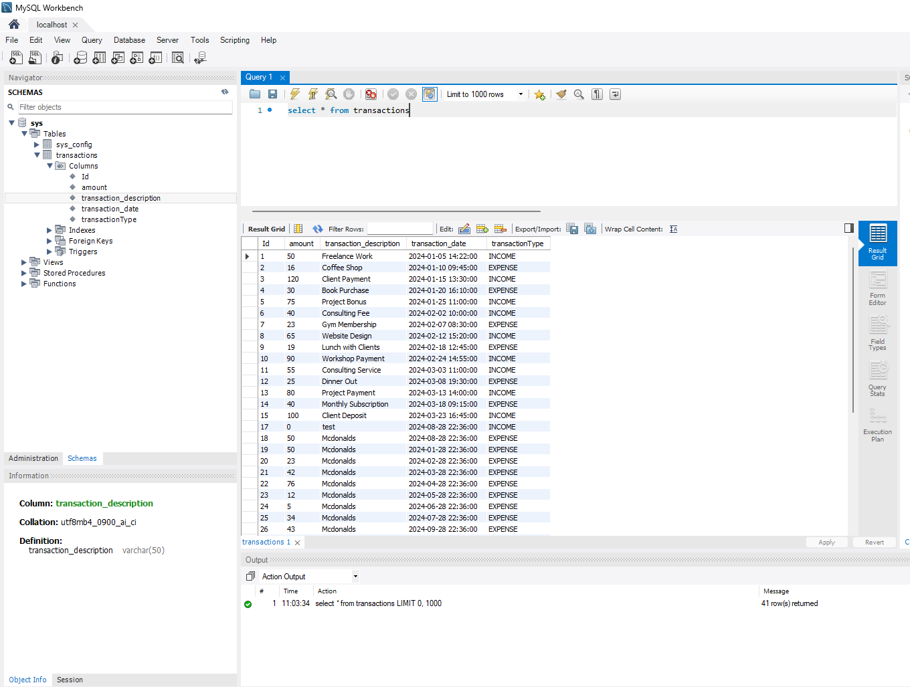

# Bank App

A simple banking application built with ASP.NET Web App, following the MVC pattern. This app allows users to track their income, expenses, and manage their finances.

## Features

- **Dashboard**
  - View total income, expenses, and current balance.
  
- **Transactions**
  - View history of all transactions, categorized as either income or expense.
  - Edit or delete any transaction.

- **Create Transaction**
  - Add new income or expense transactions to the database.

## Technology Stack

- **ASP.NET MVC**: For the web application structure.
- **SQL Server**: To store all transaction data.
- **Bootstrap**: For responsive design and form management.
- **Chart.js**: For displaying visual data on the dashboard.

## Screenshots

## Demo GIF

### Dashboard

### Transactions

### Database

